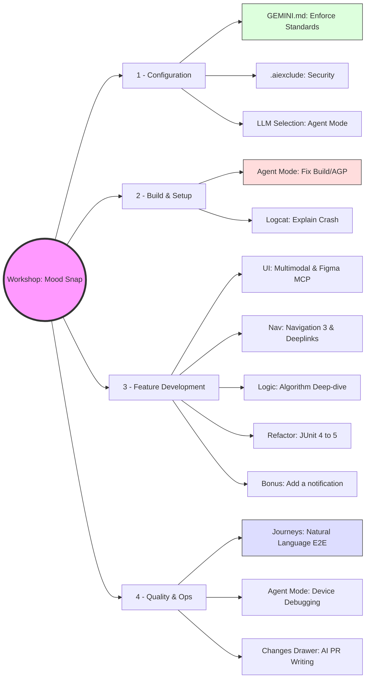

# Mood Snap
This is a sample project to explore [Gemini in Android](https://developer.android.com/studio/gemini/overview). The app is a simple mood tracker which can be built by completing the steps as described in the Issues 1 - 9.
There is a matching branch which is the starting point for each Issue. 

| Issue | Branch                       | Activity |
|-------|------------------------------|----------|
| [#1]  | [01-setup]                   |          |
| [#2]  | [02-foundation]              |          |
| [#3]  | [03-ui-scaffold]             |          |
| [#4]  | [04-nav-deep]                |          |
| [#5]  | [05-logic-ref]               |          |
| [#6]  | [06-design-sync]             |          |
| [#7]  | [07-testing]                 |          |
| [#8]  | [08-debug-pr]                |          |
| [#9]  | [09-bonus-notification-docs] |          |

[#1]: https://github.com/maiatoday/mood-snap/issues/1
[#2]: https://github.com/maiatoday/mood-snap/issues/1
[#3]: https://github.com/maiatoday/mood-snap/issues/1
[#4]: https://github.com/maiatoday/mood-snap/issues/1
[#5]: https://github.com/maiatoday/mood-snap/issues/1
[#6]: https://github.com/maiatoday/mood-snap/issues/1
[#7]: https://github.com/maiatoday/mood-snap/issues/1
[#8]: https://github.com/maiatoday/mood-snap/issues/1
[#9]: https://github.com/maiatoday/mood-snap/issues/1
[01-setup]: https://github.com/maiatoday/mood-snap/tree/01-setup
[02-foundation]: https://github.com/maiatoday/mood-snap/tree/02-foundation
[03-ui-scaffold]: https://github.com/maiatoday/mood-snap/tree/03-ui-scaffold
[04-nav-deep]: https://github.com/maiatoday/mood-snap/tree/04-nav-deep
[05-logic-ref]: https://github.com/maiatoday/mood-snap/tree/05-logic-ref
[06-design-sync]: https://github.com/maiatoday/mood-snap/tree/06-design-sync
[07-testing]: https://github.com/maiatoday/mood-snap/tree/07-testing
[08-debug-pr]: https://github.com/maiatoday/mood-snap/tree/08-debug-pr
[09-bonus-notification-docs]: https://github.com/maiatoday/mood-snap/tree/09-bonus-notification-docs