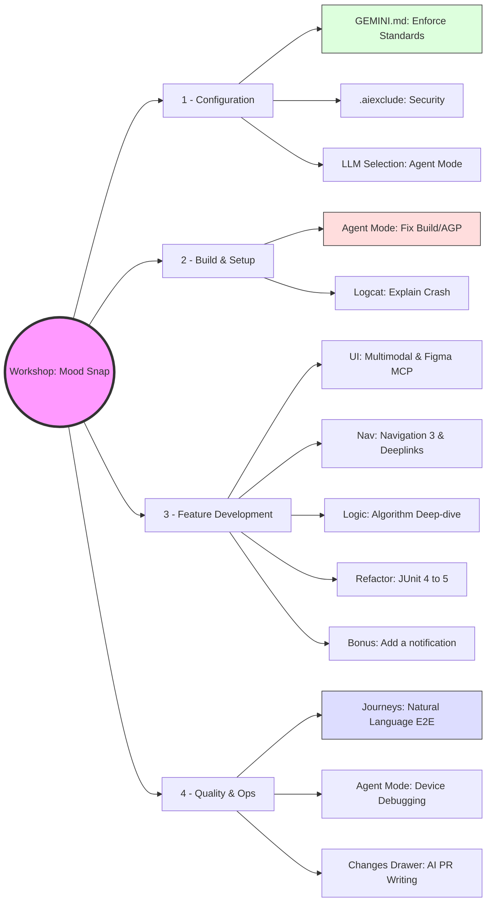

# Mood Snap
This is a sample project to explore [Gemini in Android](https://developer.android.com/studio/gemini/overview). The app is a simple mood tracker which can be built by completing the steps as described in the Issues 1 - 9.
There is a matching branch which is the starting point for each Issue. 

| Issue | Branch | Activity |
|-------|--------|----------|
| [#1]  |        |          |
| [#2]  |        |          |
| [#3]  |        |          |
| [#4]  |        |          |
| [#5]  |        |          |
| [#6]  |        |          |
| [#7]  |        |          |
| [#8]  |        |          |
| [#9]  |        |          |

[#1]: https://github.com/maiatoday/mood-snap/issues/1
[#2]: https://github.com/maiatoday/mood-snap/issues/1
[#3]: https://github.com/maiatoday/mood-snap/issues/1
[#4]: https://github.com/maiatoday/mood-snap/issues/1
[#5]: https://github.com/maiatoday/mood-snap/issues/1
[#6]: https://github.com/maiatoday/mood-snap/issues/1
[#7]: https://github.com/maiatoday/mood-snap/issues/1
[#8]: https://github.com/maiatoday/mood-snap/issues/1
[#9]: https://github.com/maiatoday/mood-snap/issues/1
